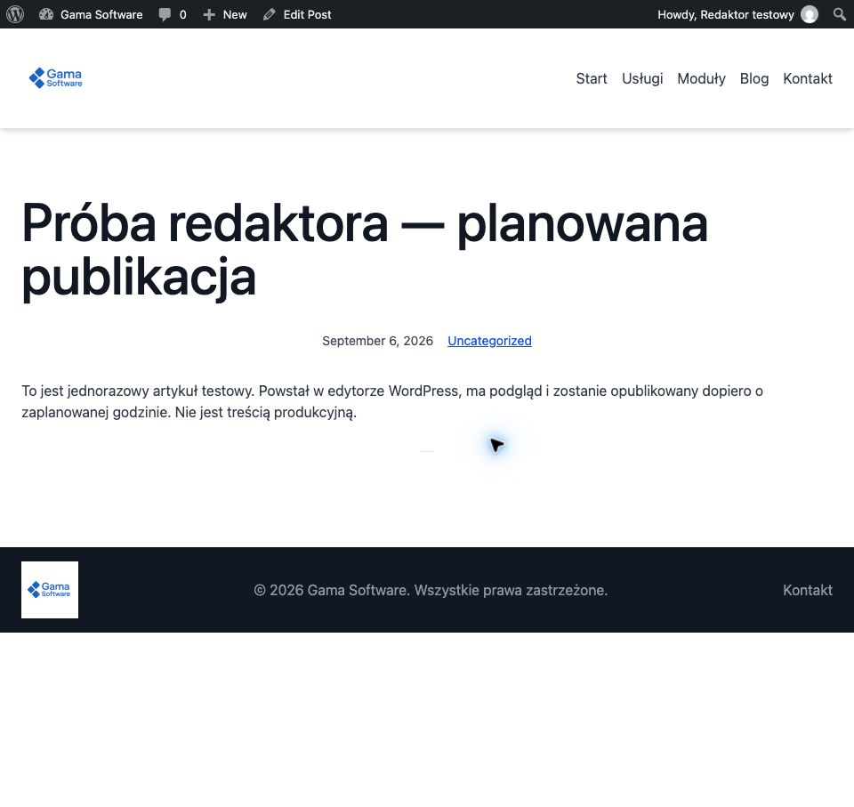
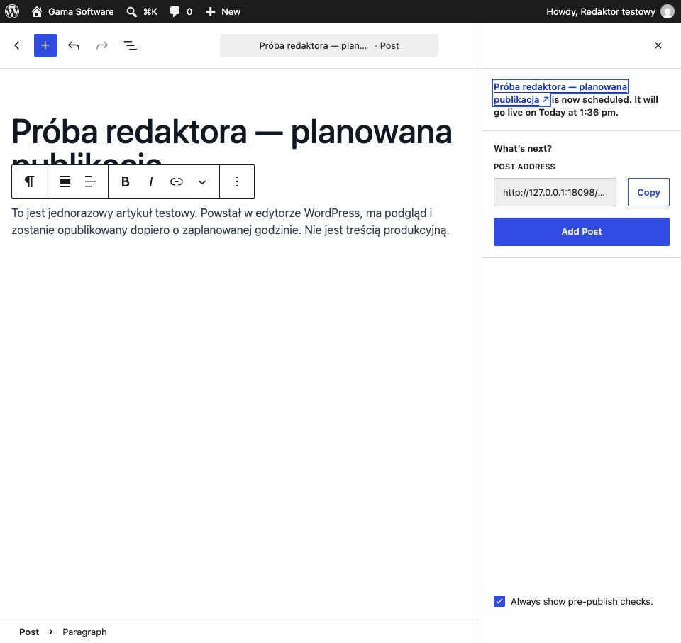
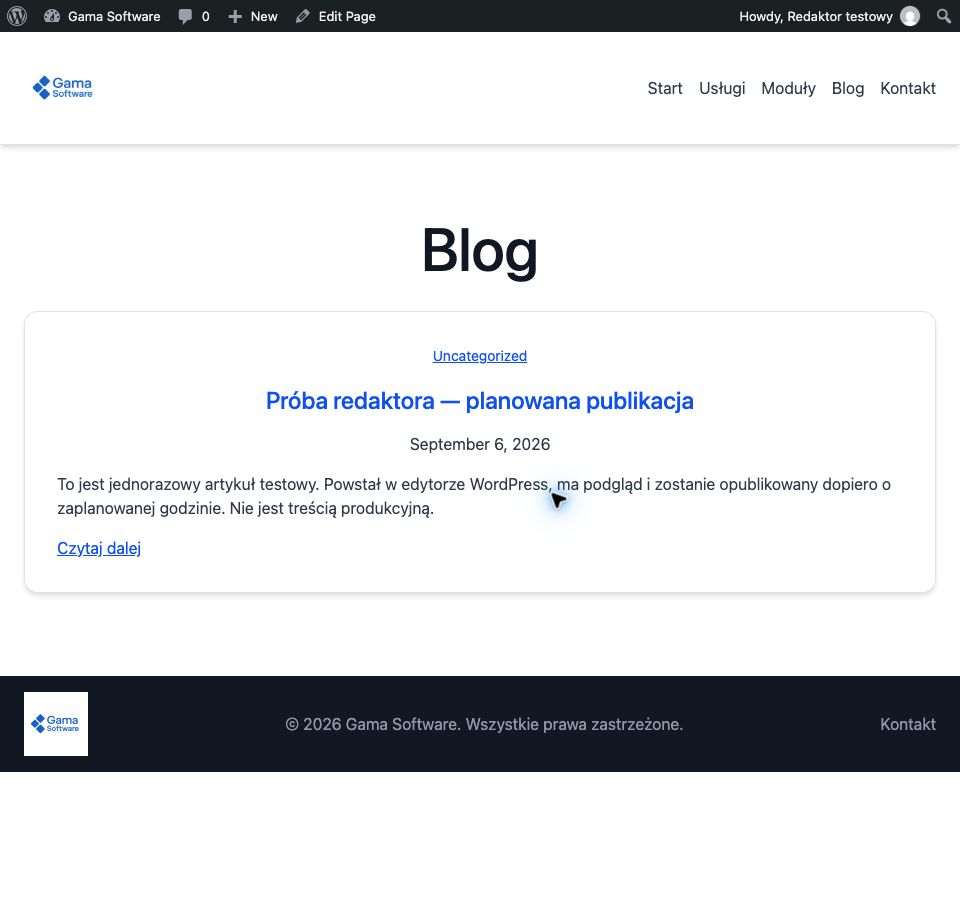
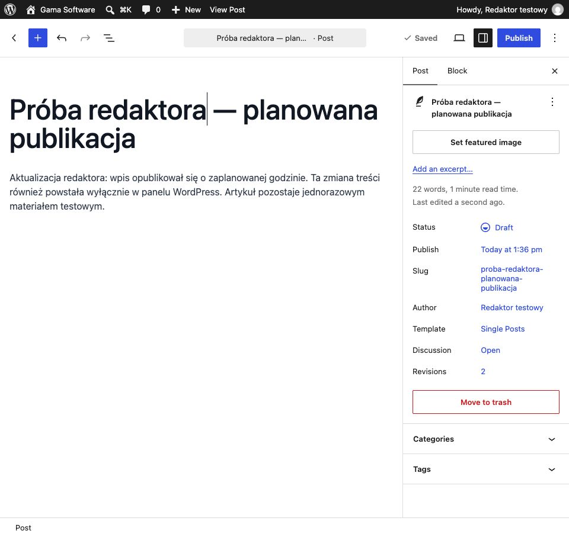

# Blog — instrukcja dla redaktora

Zrzuty pochodzą z [próby WordPress 7.1 / motywu 0.4.1 z 2026-09-06](GSWEB-18-editor-journey-2026-09-06.md),
z anglojęzycznego panelu i jednorazowej treści. Dlatego poniżej użyto nazw
przycisków widocznych na ekranach. Adres `127.0.0.1:18098` był tylko adresem
testu i już nie działa. Do pracy użyj panelu zatwierdzonej witryny; lokalny
podgląd projektu jest pod `http://localhost:8090/`.

To instrukcja obsługi bloga, nie zgoda na publikację treści, przełączenie
produkcji ani pełna instrukcja Site Editor.

## 1. Utwórz szkic

Po zalogowaniu kontem redaktora wybierz **Posts → Add Post**. Wpisz tytuł,
a następnie dodaj akapit treści. **Save draft** zapisuje pracę bez publikacji.
Potwierdzeniem jest komunikat „Draft saved” i status **Draft** w zakładce
**Post** po prawej stronie.

Przed publikacją sprawdź treść, linki, kategorię oraz potrzebną miniaturę.
Dla znaczącego obrazu podaj opis alternatywny; nie publikuj treści testowej
ani niezatwierdzonych materiałów. Uprawnienia redaktora nie wymagają
instalowania wtyczek lub edycji kodu.

## 2. Obejrzyj podgląd

Na górnym pasku otwórz **View** (ikona ekranu) i wybierz
**Preview in new tab**. Zobaczysz wpis w szablonie witryny. Sprawdź tytuł,
akapity i nawigację. W tym samym menu są podglądy **Desktop**, **Tablet**
i **Mobile**; przed publikacją sprawdź także wąski układ.

Podgląd nie jest publiczną publikacją. W przeprowadzonej próbie niezalogowany
gość nie mógł otworzyć szkicu, a blog jeszcze go nie pokazywał.

## 3. Opublikuj później

Wróć do edytora i zakładki **Post**. Kliknij datę przy **Publish**
(na początku **Immediately**). Wybierz dzień i przyszłą godzinę; zwróć uwagę
na **AM/PM** oraz strefę czasową witryny. W próbie 1:36 PM oznaczało 13:36
w strefie `Europe/Warsaw`.

Kliknij **Schedule** na górze, sprawdź datę i widoczność w panelu potwierdzenia,
a następnie ponownie **Schedule**. Oczekiwany komunikat to „Post scheduled”
oraz podana data. Jeśli zamierzasz tylko zachować szkic, nie zatwierdzaj tego
panelu. Aby opublikować od razu, zamiast przyszłej daty użyj bieżącej daty
i przycisku **Publish**, po sprawdzeniu treści i widoczności.

Po terminie sprawdź `/blog/`, sekcję bloga strony głównej oraz adres artykułu
jako niezalogowany gość. W teście wpis pojawił się dopiero po wybranej godzinie.

Planowanie wymaga działającego zegara zadań WordPressa na serwerze. Jeśli
minął termin, a wpis nadal jest zaplanowany lub oznaczony jako spóźniony,
przekaż operatorowi adres wpisu i oczekiwaną datę. Nie zmieniaj w tym celu
ustawień serwera ani kodu. Test lokalny nie zastępuje kontroli harmonogramu
na docelowym stagingu i produkcji.

## 4. Zmień lub wycofaj wpis

Otwórz artykuł na liście **Posts**, zmień treść i naciśnij **Save**.
Komunikat „Post updated” potwierdza zapis. Sprawdź wynik pod publicznym adresem.

Aby wycofać wpis, w zakładce **Post** kliknij bieżący **Status**, wybierz
**Draft**, zamknij panel statusu i naciśnij **Save**. Oczekuj „Post reverted
to draft”. Treść pozostaje w panelu, ale wpis przestaje być publiczny i znika
z list. Nie używaj **Move to trash**, jeśli chcesz jedynie wycofać publikację.

Po zakończeniu sprawdź, czy wszystkie zamierzone zmiany są zapisane.
Nie udostępniaj swojego hasła ani linków do prywatnych podglądów.
