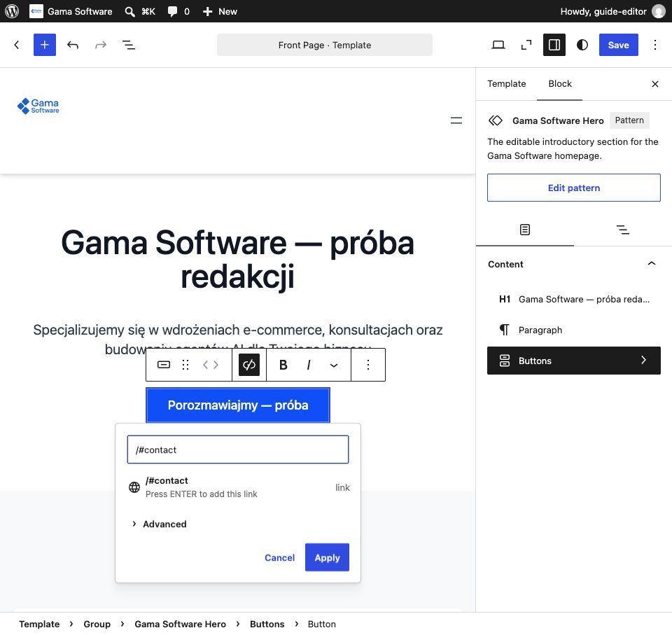
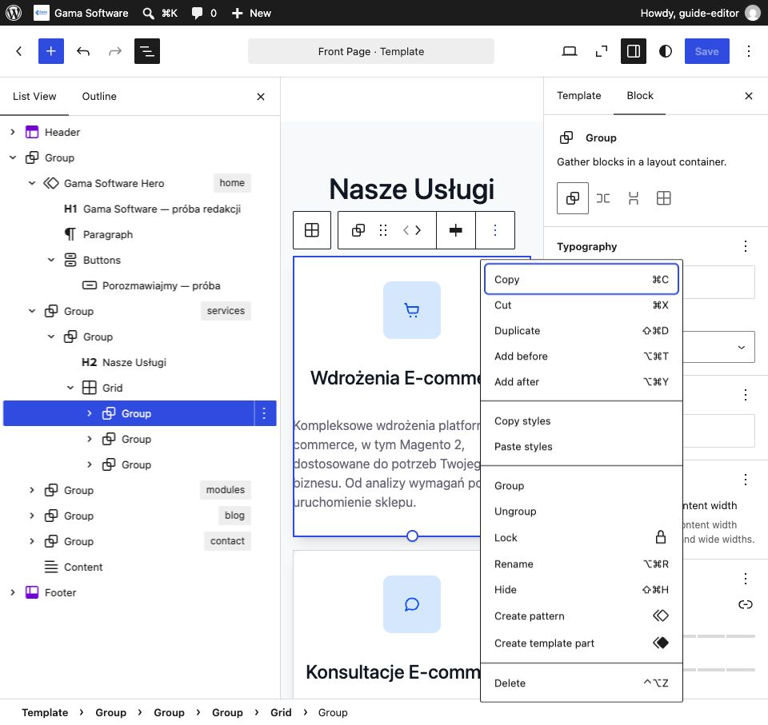
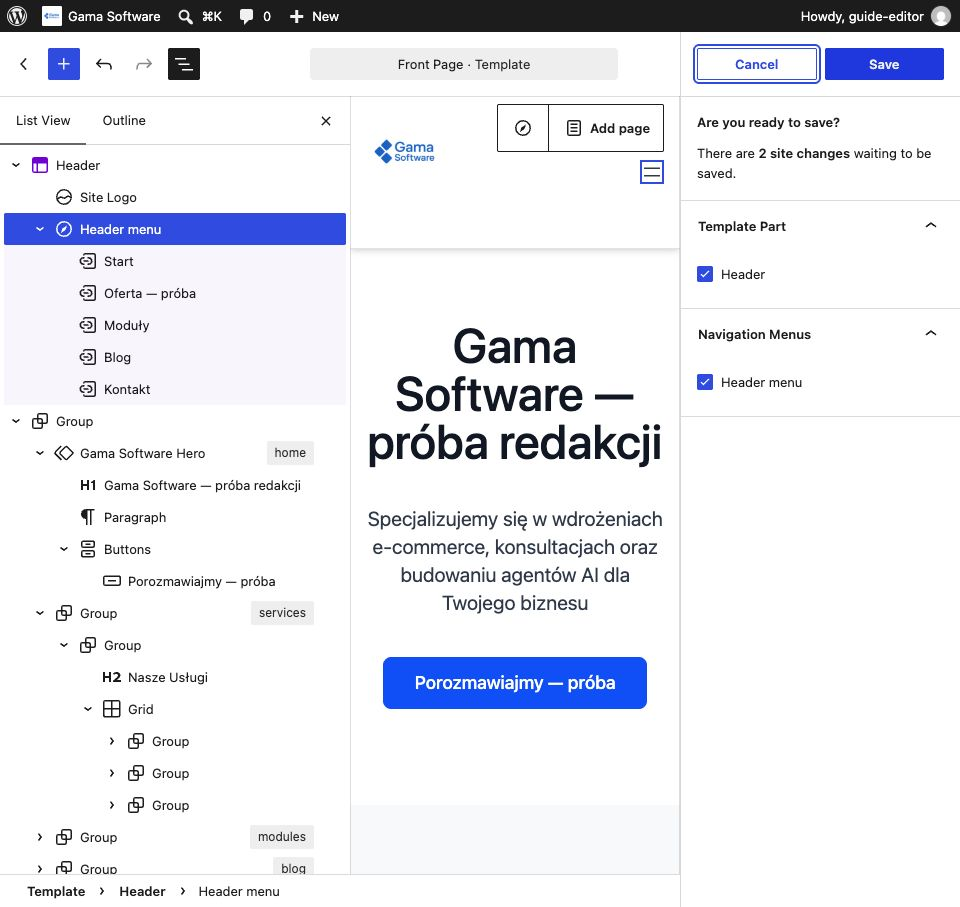
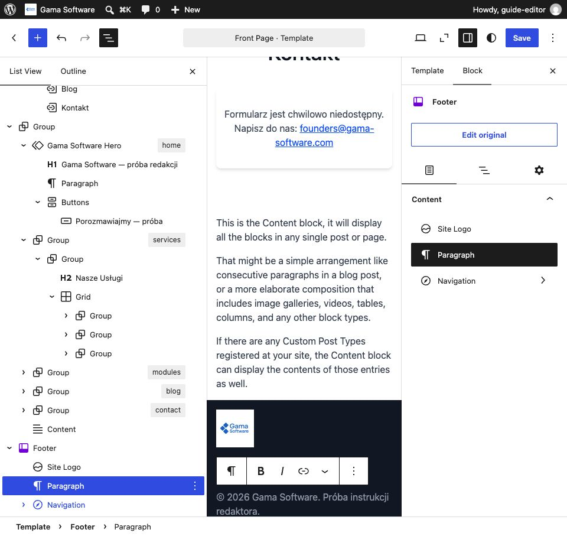
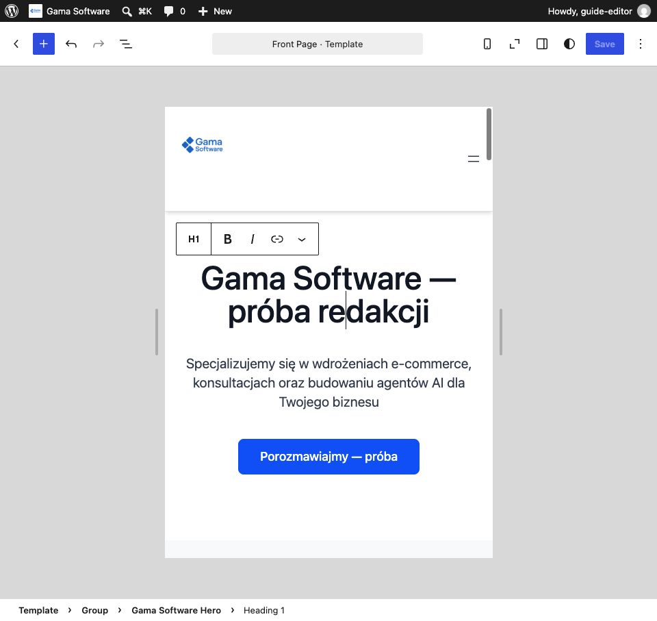
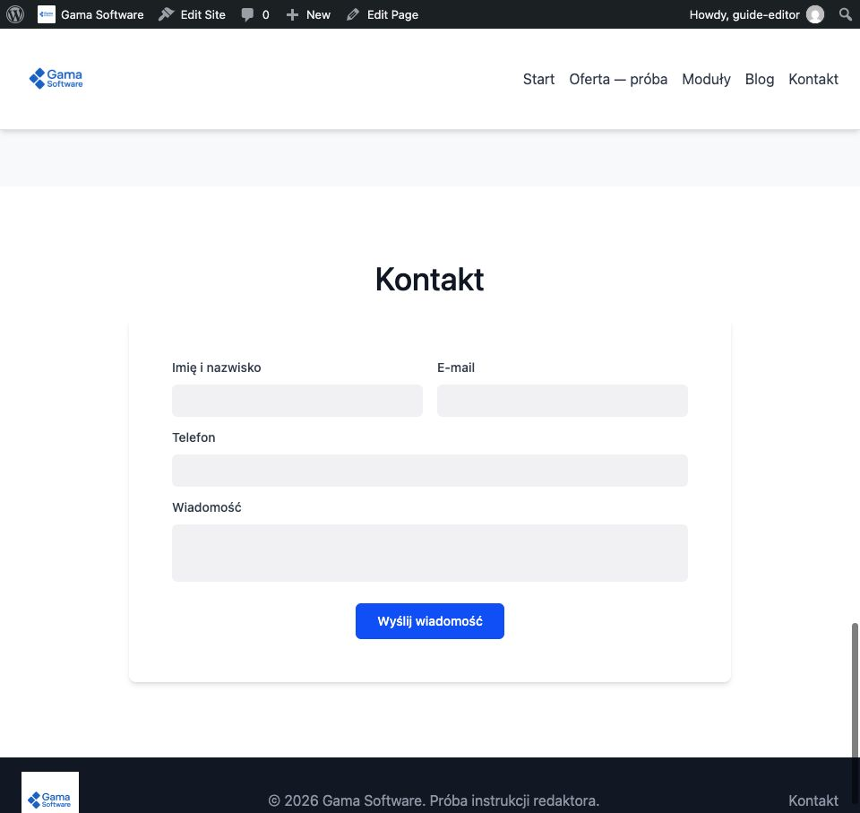

# Strona główna, menu i stopka — instrukcja redaktora

Instrukcja pokazuje edycję bez kodu, jako redaktor WordPressa. Zrzuty pochodzą
z [lokalnej próby WordPress 7.1 / motywu 0.4.1](GSWEB-28-editor-site-journey-2026-09-06.md)
i zawierają wyłącznie treść testową. Panel był anglojęzyczny, stąd angielskie
nazwy przycisków. Adres testowy `127.0.0.1:18099` został wyłączony; podgląd
projektu jest pod `http://localhost:8090/`.

Ćwicz na uzgodnionej kopii testowej. **Save w edytorze szablonu zmienia stronę
widoczną dla odwiedzających tej instalacji** — nie jest odpowiednikiem szkicu
wpisu. Ta instrukcja nie zatwierdza publikacji, treści ani wdrożenia produkcji.

## 1. Otwórz właściwy szablon

Zaloguj się przez `/wp-login.php` i wybierz **Appearance → Editor → Templates
→ Front Page**. Przy pierwszym otwarciu może pojawić się **Get started**.
Na górze powinno być **Front Page · Template**. **Pages → Home** to edycja
treści strony, a nie szablonu zawierającego nasze sekcje.

Ikona **Document Overview** na górze otwiera **List View**. To lista bloków:
Header, grupy sekcji, Content i Footer. Rozwijaj strzałki przy grupach, aby
wybrać konkretny nagłówek, akapit, przycisk lub kartę.

## 2. Zmień Hero i główny przycisk

Hero to pierwszy fragment z nagłówkiem „Gama Software”. Zaznacz jego tekst
w podglądzie i wpisz zatwierdzoną treść. Tak samo zmienisz akapit poniżej.
Zachowaj poziom **H1** nagłówka, **H2** dla sekcji i **H3** dla kart.

CTA oznacza przycisk zachęcający do działania, np. „Poznaj nasze usługi”.
Kliknij tekst przycisku, aby go zmienić. Ikona odnośnika otwiera ustawienia
linku; wybierz **Edit link**, wpisz adres i naciśnij **Apply**. Przykład:
`/#services` prowadzi do usług, a `/#contact` do kontaktu — również z bloga.

Kliknij **Save**. Oczekuj komunikatu „Template updated” lub „Site updated”.
Jeżeli otworzy się panel potwierdzenia, sprawdź listę zmian i zatwierdź
ponownie **Save**. Nie zamykaj karty podczas niezakończonego zapisu.

## 3. Dodaj albo usuń kartę usługi

W **List View** rozwiń grupę z oznaczeniem `services`, wewnętrzną grupę,
a następnie **Grid**. Każda karta jest osobnym **Group** wewnątrz Grid.
Zaznaczenie powinno obejmować jedną kartę, nie cały Grid lub sekcję.

Otwórz menu trzech kropek tej karty i wybierz **Duplicate**. W kopii zmień
tytuł i opis, sprawdź ikonę oraz zapisz. Aby usunąć kartę, zaznacz dokładnie
jej Group i wybierz **Delete**, następnie zapisz. **Undo** pozwala cofnąć
przypadkową operację podczas bieżącej edycji; przed usunięciem zawsze sprawdź
obramowanie wybranego elementu.

Sekcja `modules` również zawiera Grid z kartami. Wybieraj jej nagłówki,
opisy i listy przez List View. Nie zmieniaj kotwic sekcji `home`, `services`,
`modules` i `contact`, bo korzystają z nich menu i przyciski. Ręczna próba
opisana przy tej instrukcji obejmowała dodanie i usunięcie **usługi**, nie
pełny osobny scenariusz edycji modułów.

## 4. Zmień menu

Wybierz menu w **Header**; jeśli widoczny jest przycisk **Edit navigation**,
wejdź nim do edycji. Zaznacz pozycję, np. „Usługi”. W jej ustawieniach zmień
**TEXT**, pozostawiając właściwy adres w **Link**. Sama zmiana nazwy pozycji
nie powinna usuwać jej linku. Blog prowadzi do `/blog/`, Kontakt do `/#contact`.

Przy pierwszym zapisie menu panel może pokazać dwie powiązane zmiany:
**Header** oraz **Header menu**. Jeśli obie należą do Twojej edycji, pozostaw
obie zaznaczone i zatwierdź **Save**. Nie zatwierdzaj obcych zmian.

Header jest współdzielony: po zapisie sprawdź menu na stronie głównej
**i na blogu**, w tym powrót z bloga do konkretnej sekcji.

## 5. Zmień stopkę; nie usuwaj formularza

W List View rozwiń **Footer**, wybierz **Paragraph** i zmień tekst stopki.
Kliknij **Save**, sprawdź Footer na liście zmian i potwierdź zapis.
Stopka także jest wspólna dla strony głównej i bloga.

Widoczny w edytorze opis **Content** jest pomocą WordPressa, nie tekstem
publikowanym na stronie. Kontakt w edytorze może pokazywać zastępczy tekst
„Formularz jest chwilowo niedostępny”, podczas gdy na stronie działa formularz.
**Nie usuwaj z tego powodu Content ani grupy formularza.** Sprawdź rzeczywistą
stronę. Gdy również tam brakuje pól formularza, zgłoś błąd operatorowi.
Pola, walidację i wysyłkę obsługuje wtyczka; redaktor nie ustawia tu SMTP,
odbiorcy ani haseł.

## 6. Sprawdź wynik

Przed zapisem obejrzyj **View → Desktop** i **View → Mobile**. Po zapisie
otwórz witrynę jako odwiedzający, sprawdź logo, tekst, menu i wszystkie
zmienione przyciski. Podgląd Mobile w edytorze nie zastępuje próby na telefonie.

Kliknięcie przycisku kierującego do `/#contact` powinno pokazać sekcję Kontakt
z polami Imię i nazwisko, E-mail, Telefon, Wiadomość oraz przyciskiem wysyłki.
Testową wiadomość wysyłaj tylko w uzgodnionym środowisku z testową skrzynką;
samo przewinięcie do formularza nie potwierdza dostarczenia wiadomości.

Wpisy, podgląd, planowanie i wycofanie publikacji opisuje osobna
[instrukcja bloga](GSWEB-28-editor-blog-guide.md). Instalacją i aktualizacją
kodu oraz dostępami zajmuje się operator — nie są potrzebne do powyższej edycji.
